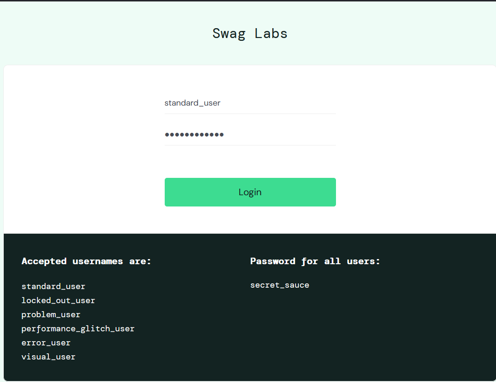
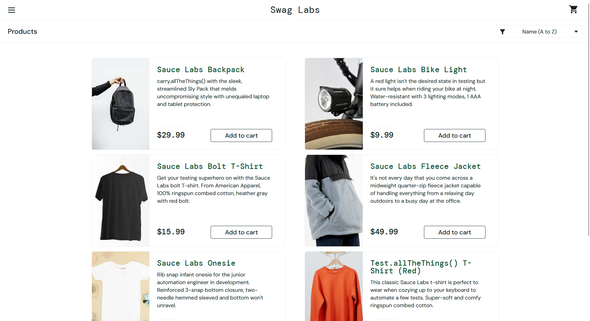
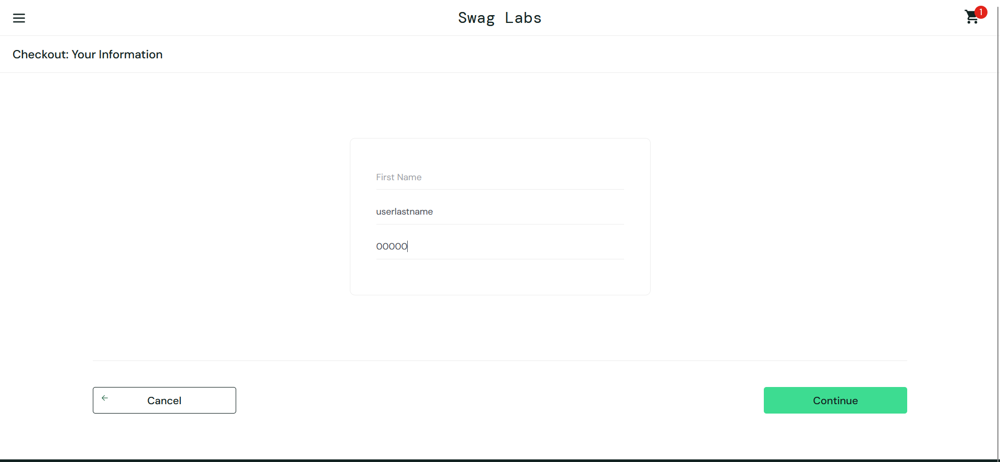
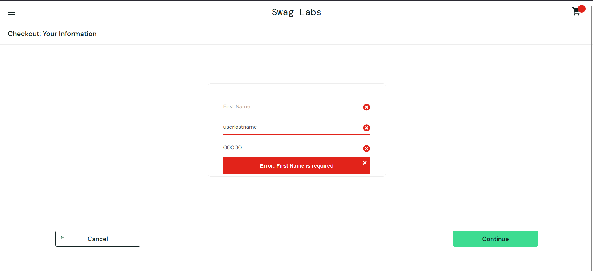

# Тест-кейс на позитивную проверку авторизации
| | | | | | | | | | | |
|---|---|---|---|---|---|---|---|---|---|---|
| | | | | | | | | | | |
|Название проекта|Swag Labs| | | | | | | | | |
|Модуль|Авторизация| | | | | | | | | |
|Автор|burnerry| | | | | | | | | |
|Дата создания|2-11-2026| | | | | | | | | |
|Ревьюер| | | | | | | | | | |
|Дата ревью| | | | | | | | | | |
| | | | | | | | | | | |
| | | | | | | | | | | |
|ID тест-кейса|Заголовок|Описание|Предусловия|Окружение|Шаги выполнения|Ожидаемый результат|Фактический результат|Статус|Исполнитель|Комментарии|
|SD-AUTH-01|Успешная авторизация с валидными данными|Вход в систему с корректным логином и паролем|- браузер открыт,   -пользователь не авторизован  - данные для входа известны|ОС: Windows 10/11;  Browser: Firefox 147.0.3.(64-разрядная); 1920×1200 (fullscreen); Язык/Валюта:  ENG/ $;  Время:Moscow;  Сеть: стабильная (без VPN); Расширения: Нет|1. Открыть saucedemo.com  2. Ввести логин: standard_user  3.Ввести пароль: secret_sauce  4. Нажать кнопку "Login" |1. Переход на главную страницу saucedemo.com/inventory.html  2. На странице отображаются: Заголовок "Swag Labs";  Открыта вкладка "All Users" со всеми товарами, их можно положить себе в корзину   3. Отображаются цены на товары, корректно работают фильтры поиска товаров, картинки соответсвуют названию товара  4. Интерфейс работает без ошибок и деградаций| | | | |
|SD-CHECKOUT-01|Проверка валидации обязательного поля First Name при оформлении заказа|Проверка отображения ошибки при попытке оформления заказа с незаполненным полем First Name|-Пользователь авторизован  - В корзине есть минимум 1 товар  - Открыта страница Checkout|ОС: Windows 10/11;   Browser: Firefox 147.0.3.(64-разрядная);  1920×1200 (fullscreen);  Язык/Валюта:  ENG/ $;   Время:Moscow;   Сеть: стабильная (без VPN);  Расширения: Нет|1.Авторизоваться на сайте saucedemo.com  2. Добавить товар в корзину  3. Перейти в корзину и нажать Checkout  4. Оставить поле "First Name" пустым  5. Заполнить поле "Last Name": userlastname  6. Заполнить поле "ZIP/Postal Code": 00000  7. Нажать кнопку "Continue"|1.Должно появиться сообщение об ошибке: "(Error: First Name is required)"  2.Пользователь остается на странице Checkout  3.Переход на следующий шаг не происходит| | | | |

# Процесс проверки позитивного тест-кейса

# Процесс проверки негативного тест-кейса

