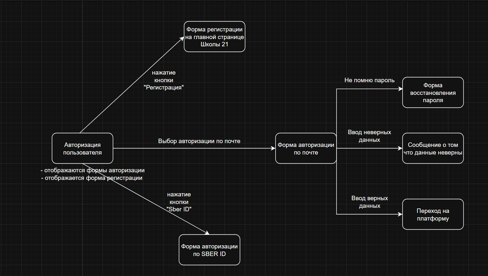

# Таблица переходов и состояний для страницы авторизации

## Состояния системы

- **S0** — Начальное состояние (страница авторизации открыта, поля пустые)
- **S1** — Форма заполнена (введены логин и пароль)
- **S2** — Успешная авторизация (пользователь вошёл в систему)
- **S3** — Ошибка авторизации (неверный логин или пароль)
- **S4** — Страница восстановления пароля

## События (действия)

- **E1** — Ввод логина и пароля
- **E2** — Нажатие кнопки "Войти" с корректными данными
- **E3** — Нажатие кнопки "Войти" с некорректными данными 
- **E4** — Клик на ссылку "Забыли пароль?"
- **E5** — Клик на кнопку "Назад" / "Вернуться к авторизации"
- **E6** — Клик на кнопку "Выйти"

| Текущее состояние | Событие | Следующее состояние | Условие | Действие системы |
|-------------------|---------|---------------------|---------|------------------|
| S0 | E1 | S1 | Данные введены | Активируется кнопка "Войти" |
| S1 | E2 | S2 | Логин и пароль верны | Переход на главную страницу |
| S1 | E3 | S3 | Логин или пароль неверны (попытка 1-2) | Показать сообщение об ошибке |
| S0 | E4 | S4 | - | Открыть форму восстановления пароля |
| S3 | E1 | S1 | Данные исправлены | Разрешить повторную попытку входа |
| S3 | E4 | S4 | - | Открыть форму восстановления пароля |
| S5 | E5 | S0 | - | Вернуться к форме авторизации |
| S2 | E6 | S0 | - | Разлогинить пользователя |
| S4 | E4 | S5 | - | Попытка восстановить доступ |

# Диаграмма переходов и состояний для страницы авторизации

