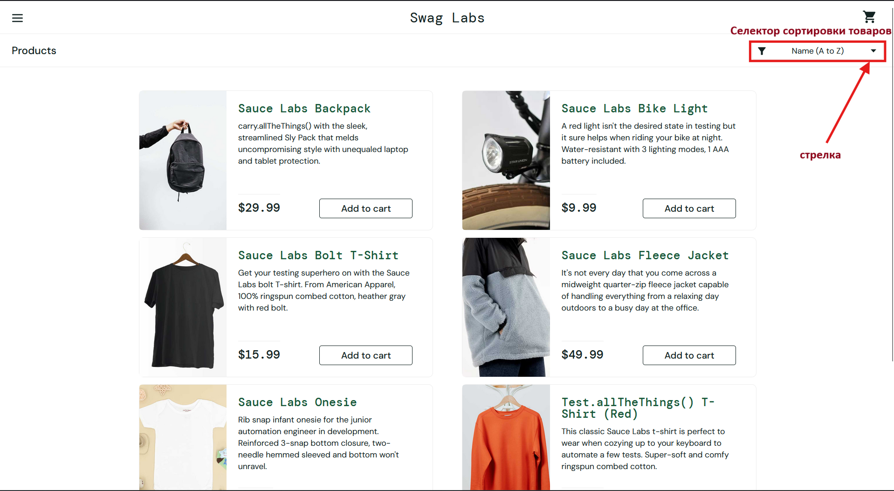

# Баг-репорт

| Идентификатор | Краткое описание | Подробное описание | Шаги по воспроизведению |
| :--- | :--- | :--- | :--- |
| 1 | Селектор сортировки товаров на странице каталога не открывается при клике на иконку стрелки | При взаимодействии с селектором сортировки товаров на странице каталога обнаружено некорректное поведение: клик по иконке стрелки, расположенной внутри селектора, не приводит к его раскрытию. При этом клик по основной области селектора работает корректно и открывает список опций. Данное поведение нарушает ожидаемую логику взаимодействия с элементом интерфейса и может вводить пользователя в заблуждение. **Ожидаемый результат:** селектор открывается при клике на иконку стрелки. **Фактический результат:** селектор не открывается при клике на иконку стрелки, при этом открывается при клике на само поле селектора. | 1. Авторизоваться на сайте. 2. Открыть страницу каталога товаров. 3. Найти селектор сортировки товаров. 4. Нажать на иконку стрелки внутри селектора. **Дефект:** селектор не раскрывается при клике на иконку стрелки, хотя клик по основному полю работает корректно. |

| Воспроизводимость | Критичность(Priority) | Серьёзность (Severity) | Симптом | Возможность обойти | Комментарий |
| :--- | :--- | :--- | :--- | :--- | :--- |
| Всегда | Medium | Minor | Некорректная операция | Да | Пользователь может открыть селектор кликом по основному полю, минуя иконку стрелки. | 

|Приложения|
| :--- |
 
---
## Почему это баг

- Иконка стрелки является стандартным интерактивным элементом → пользователь ожидает, что она кликабельна  
- Поведение неконсистентно: клик по полю работает, по стрелке — нет  
- Отсутствуют визуальные признаки, что стрелка неактивна  

**Вывод:** это дефект реализации, а не ожидаемое поведение  

---

## Возможные причины

- Нет обработчика `onClick` на иконке  
- CSS-проблемы (`pointer-events: none`, перекрытие, z-index)  
- Разделение селектора на разные элементы без общей логики  

### Возможные точки исправления:
- Сделать весь селектор одной кликабельной зоной  
- Добавить обработчик на иконку  
- Проверить CSS и перекрытия   

---

## Влияние на пользователя

- Путаница 
- Потеря доверия к интерфейсу  
- Замедление пользовательского сценария  

## Влияние на бизнес

- Снижение конверсии (сложнее найти товар)    
- Увеличение обращений в поддержку  
- Негативное впечатление о продукте  
