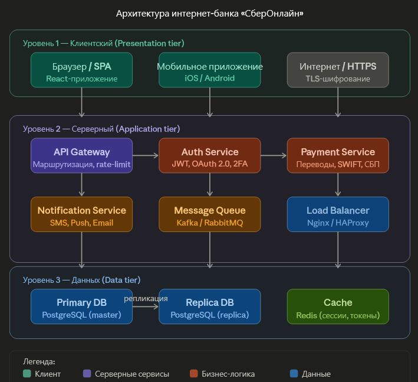

# Задание 1. Клиент-серверная архитектура

## Блок схема клиент-серверной архитектуры интернет-банка «СберОнлайн»

 
### Архитектурная схема: интернет-банк «СберОнлайн»
 
Трёхзвенная архитектура интернет-банка включает следующие уровни и ключевые компоненты:
 
**Уровень 1 — Клиентский (Presentation tier)**
- **Браузер / SPA** — React-приложение, работающее в браузере пользователя
- **Мобильное приложение** — нативные приложения iOS / Android
- **Интернет / HTTPS** — канал передачи данных с TLS-шифрованием
**Уровень 2 — Серверный (Application tier)**
- **API Gateway** — единая точка входа, маршрутизация запросов, rate-limiting, аутентификация запросов
- **Auth Service** — сервис аутентификации и авторизации (JWT, OAuth 2.0, двухфакторная аутентификация)
- **Payment Service** — обработка платёжных операций, интеграция со SWIFT и СБП
- **Notification Service** — отправка уведомлений (SMS, Push, Email)
- **Message Queue (Kafka / RabbitMQ)** — асинхронное взаимодействие между сервисами
- **Load Balancer (Nginx / HAProxy)** — балансировка нагрузки между экземплярами сервисов
**Уровень 3 — Данных (Data tier)**
- **Primary DB (PostgreSQL master)** — основная база данных, принимает все операции записи
- **Replica DB (PostgreSQL replica)** — реплика для операций чтения и резерв при отказе мастера
- **Cache (Redis)** — хранение сессий, токенов, результатов частых запросов
---
 
### Компоненты архитектуры и тестирование
 
| Компонент архитектуры | 1–2 наиболее вероятных типа сбоя | Как проявляется для пользователя | Тип нефункционального тестирования |
|---|---|---|---|
| **API Gateway** | 1. Перегрузка / исчерпание пула соединений под высокой нагрузкой | Все запросы зависают или возвращают ошибку 503/504; страница банка не открывается | Нагрузочное тестирование (Load Testing) |
| **API Gateway** | 2. Неправильная маршрутизация после деплоя (routing misconfiguration) | Запрос на перевод уходит не тому сервису → операция «пропадает» или возвращает неожиданный ответ | Функциональное smoke-тестирование после деплоя; тестирование конфигурации |
| **Primary DB (PostgreSQL)** | 1. Отказ мастер-узла (hardware/сетевой сбой) | Все операции записи (платежи, смена пароля) недоступны; пользователь видит «Сервис временно недоступен» | Тестирование отказоустойчивости (Failover Testing) |
| **Primary DB (PostgreSQL)** | 2. Медленные запросы из-за деградации индексов или блокировок | Страницы с историей операций грузятся 10–30 с или не загружаются вовсе | Тестирование производительности (Performance Testing), профилирование БД |
 
---
 
### Горячий и холодный резерв: сравнение
 
| Критерий | Горячий резерв (Hot Standby) | Холодный резерв (Cold Standby) |
|---|---|---|
| **Готовность** | Постоянно активен, синхронизирован, готов принять нагрузку в любой момент | Выключен или работает в минимальном режиме; требует ручного / автоматического запуска |
| **Синхронизация данных** | Синхронная или близко к синхронной репликация (RPO ≈ 0–секунды) | Периодические резервные копии или отложенная репликация (RPO = минуты–часы) |
| **Время переключения (RTO)** | Секунды (автоматический failover) | Минуты–часы (требуется поднять окружение, восстановить данные) |
| **Стоимость** | Высокая: вся инфраструктура работает постоянно и оплачивается | Низкая: резервный узел не потребляет ресурсы в простое |
| **Плюсы** | Минимальные потери данных и времени; прозрачно для пользователя; автоматизированный failover | Дёшево; подходит для некритичных систем; простота настройки |
| **Минусы** | Высокие затраты; сложность настройки синхронизации; нагрузка на сеть | Значительный RTO; возможна потеря данных за период RPO; требует ручного вмешательства |
 
---
 
### Сценарий тестирования отказоустойчивости: Primary DB с горячим резервом
 
**Компонент:** Primary DB (PostgreSQL master + hot standby replica)
 
**Цель теста:** убедиться, что при отказе мастер-узла система автоматически переключается на горячий резерв без потери транзакций и без ощутимого простоя для пользователя.
 
**Предусловия:**
- Развёрнута пара PostgreSQL master/replica с потоковой репликацией и автоматическим failover (например, через Patroni + etcd)
- На систему подана фоновая нагрузка: 100 виртуальных пользователей непрерывно выполняют операции чтения и записи (просмотр баланса + инициация платежей)
**Шаги сценария:**
 
1. Зафиксировать базовые метрики в нормальном режиме работы (5 минут).
2. В момент пиковой нагрузки принудительно завершить процесс мастер-узла (`pg_ctl stop -m immediate` или `kill -9 <pid>`).
3. Наблюдать поведение системы: фиксировать момент обнаружения сбоя, момент переключения, момент восстановления доступности.
4. Проверить, что транзакции, начатые до сбоя, либо завершились, либо корректно откатились (нет «подвисших» платежей).
5. Через 10 минут поднять прежний мастер как новую реплику и проверить корректность синхронизации.
**Ожидаемый результат:** время недоступности не превышает 30 секунд; потери подтверждённых транзакций нет; пользователь видит не более одного кратковременного сообщения об ошибке с последующим автоматическим повтором запроса.
 
**Метрики для отслеживания:**
 
| Метрика | Что показывает | Целевое значение |
|---|---|---|
| RTO (Recovery Time Objective) | Время от фиксации сбоя до восстановления доступности | ≤ 30 с |
| RPO (Recovery Point Objective) | Объём данных, потерянных при переключении | 0 транзакций (синхронная репликация) |
| Replication lag до сбоя | Отставание реплики от мастера | < 1 с |
| Error rate (% ошибочных запросов) | Доля запросов, получивших 5xx в период failover | < 5% |
| P99 latency | Время отклика 99-го перцентиля во время переключения | ≤ 3 с |
| Failover detection time | Время от падения мастера до обнаружения агентом | ≤ 5 с |
| Transaction consistency | Наличие «подвисших» или задублированных транзакций | 0 |
