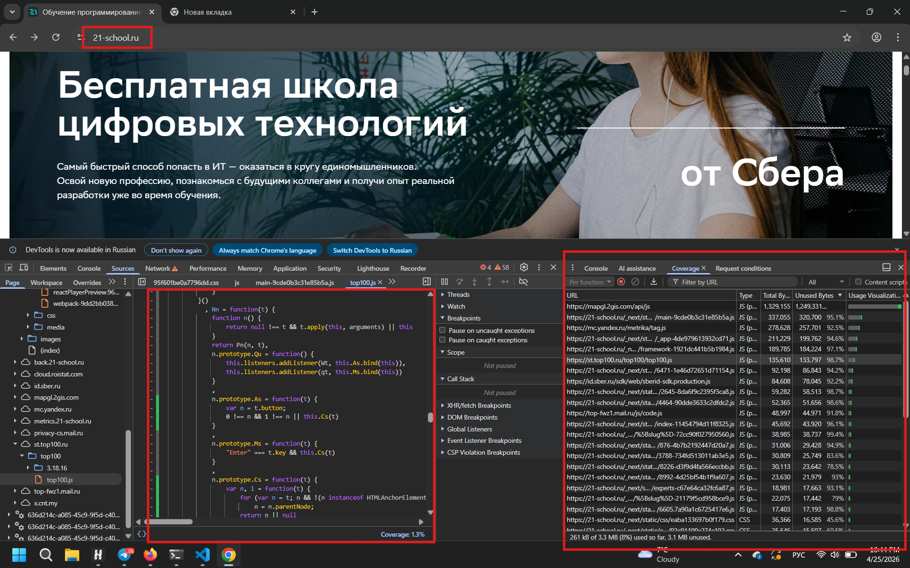
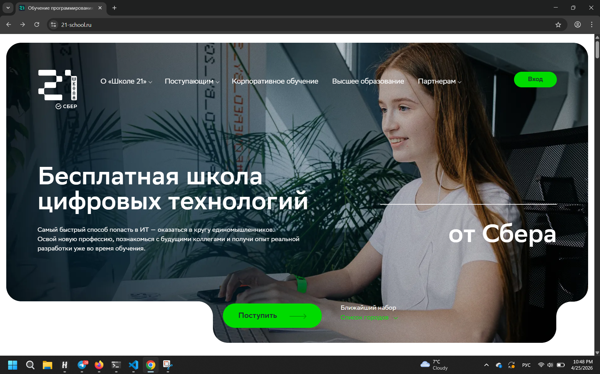
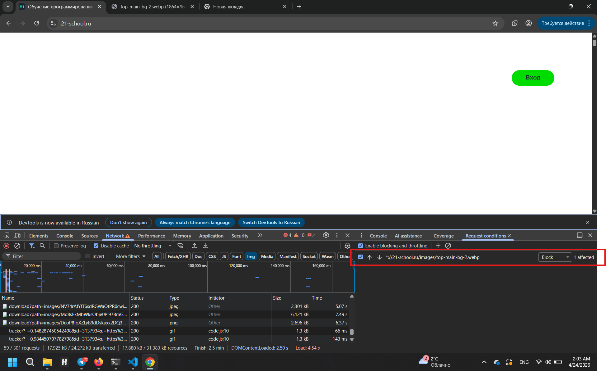

## 1. Замена названия любого элемента раздела
.png)
Нашёл нужный элемент с помощью Инспектора элементов и изменил текст хедера в дереве

## 2. Неиспользуемые CSS и JS

Coverage — это инструмент/вкладка в DevTools, которая показывает, какая часть кода (строки, функции) реально выполнилась за время сеанса записи.

Что она показывает:

    Процент выполненного кода из тех файлов, которые были загружены в память.

    Конкретные строки, которые запускались (зелёные) и которые нет (серые).

Что это НЕ означает:

    Отсутствие выполнения ≠ код не нужен.

    Возможно, нужный функционал просто не был задет во время записи (вы не нажали кнопку, не перешли в раздел, не вызвали обработчик).

    Инструмент понятия не имеет о вашей бизнес-логике — он лишь фиксирует факт исполнения.

Вывод: Coverage полезен для оптимизации и отлова явно мёртвого кода, но бесполезен для определения нужности функционала, который вы не проверяли.

## 3. Загрузка страницы
Перешёл во вкладку сеть и установил в селектора троттлинг
Fast 4G - 978 ms
Slow 4G - 1.42 s
300 kbit/s - 26.66 s

## 4. Блокировка элемента страницы

Во вкладке сеть нашёл файл с фото и заблокировал его

