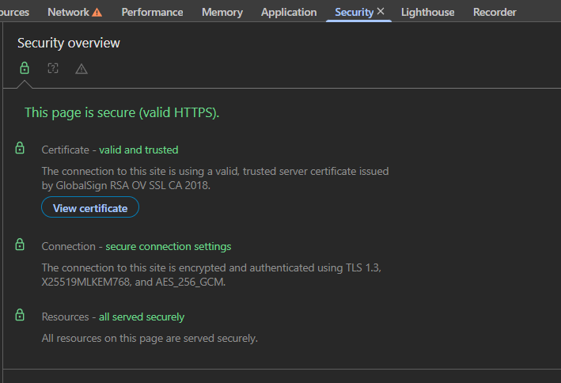
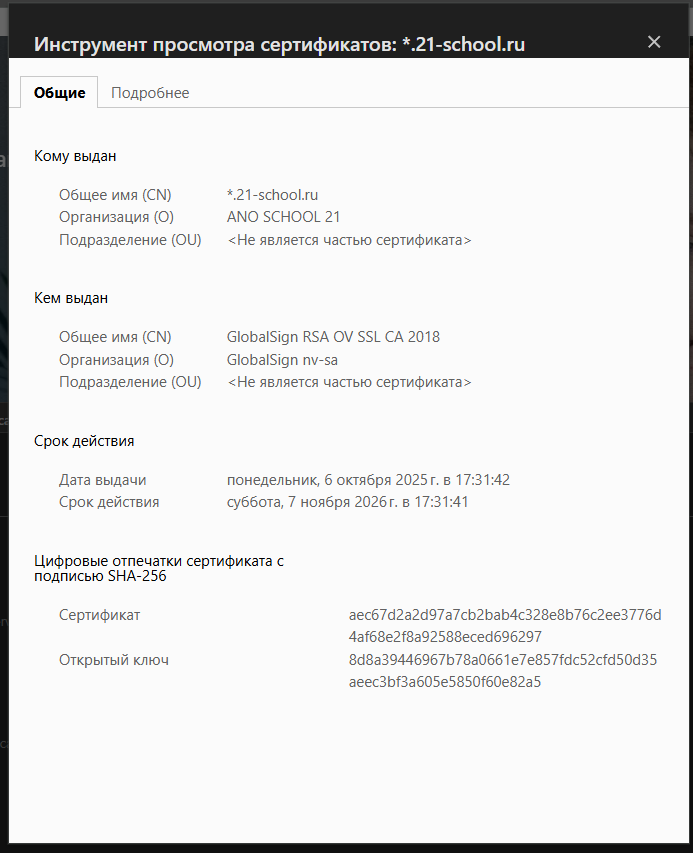
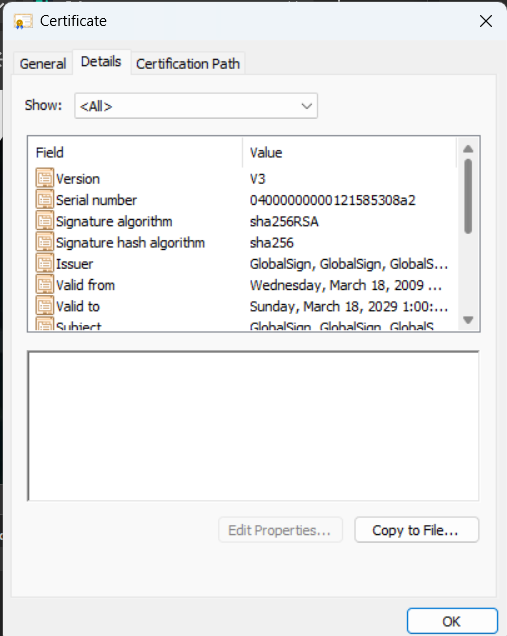
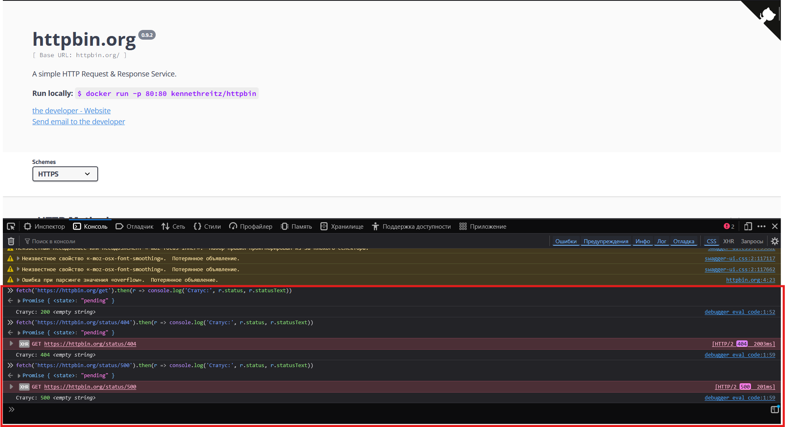
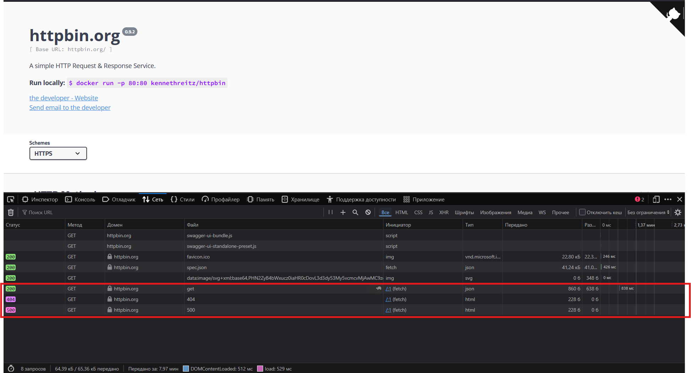
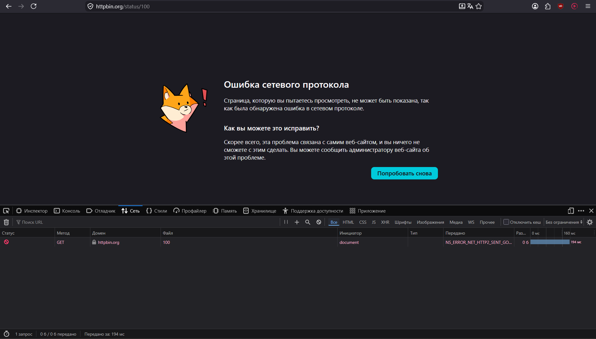
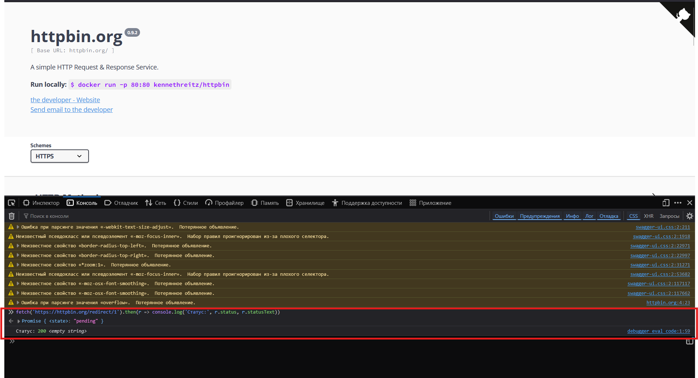
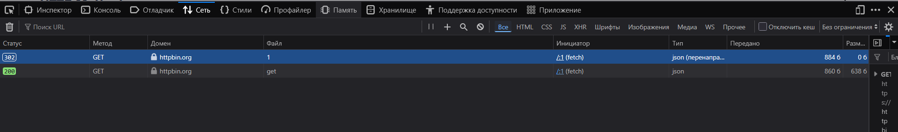

# Задание 4. Протоколы HTTP и HTTPS

---

## Часть 1. Схема работы HTTPS — шаги установления защищённого соединения

HTTPS = HTTP + TLS (Transport Layer Security). Ниже описан процесс **TLS Handshake** — «рукопожатия», которое происходит перед передачей любых данных.

---

### Шаг 1. Client Hello (Клиент → Сервер)

**Цель:** Клиент (браузер) инициирует соединение и сообщает серверу, что умеет.

Клиент отправляет:
- версии TLS, которые он поддерживает (например, TLS 1.2, TLS 1.3);
- список поддерживаемых **cipher suites** (наборов алгоритмов шифрования);
- случайное число `ClientRandom` (используется позже для генерации ключей);
- список расширений SNI, ALPN и т.д.

**Риск, который устраняет:** без этого шага сервер не знал бы, с кем говорит и какие алгоритмы использовать. Устраняет риск несовместимости и позволяет согласовать наиболее безопасный общий алгоритм.

---

### Шаг 2. Server Hello (Сервер → Клиент)

**Цель:** Сервер выбирает параметры соединения из предложенных клиентом.

Сервер отправляет:
- выбранную версию TLS;
- выбранный **cipher suite**;
- случайное число `ServerRandom`.

**Риск, который устраняет:** без согласования версии и алгоритмов злоумышленник мог бы навязать слабый алгоритм (атака **downgrade attack**). Согласование на этом шаге предотвращает это.

---

### Шаг 3. Отправка сертификата сервера (Сервер → Клиент)

**Цель:** Сервер доказывает клиенту, что он — именно тот, за кого себя выдаёт.

Сервер отправляет:
- свой **SSL/TLS-сертификат** (содержит публичный ключ и данные о владельце);
- цепочку сертификатов до корневого CA (Certificate Authority).

**Риск, который устраняет:** устраняет риск **атаки Man-in-the-Middle (MITM)**. Без проверки сертификата злоумышленник мог бы подставить свой сервер. Клиент проверяет подпись CA и срок действия.

---

### Шаг 4. Проверка сертификата клиентом

**Цель:** Браузер убеждается в подлинности сертификата.

Клиент проверяет:
- подпись сертификата (валидирует цепочку до доверенного корневого CA);
- срок действия (`Not Before` / `Not After`);
- совпадение домена (`CN` или `SAN`);
- не отозван ли сертификат (OCSP / CRL).

**Риск, который устраняет:** устраняет риск использования поддельных или просроченных сертификатов. Браузер показывает предупреждение, если проверка не прошла.

---

### Шаг 5. Key Exchange / Pre-Master Secret (Клиент → Сервер)

**Цель:** Безопасно договориться об общем секрете, не передавая его по сети.

В **TLS 1.2** (RSA): клиент генерирует `PreMasterSecret`, шифрует его публичным ключом сервера и отправляет. Только сервер с приватным ключом может расшифровать.

В **TLS 1.3** (ECDHE): используется алгоритм Диффи-Хеллмана на эллиптических кривых — стороны обмениваются публичными параметрами и независимо вычисляют общий секрет.

**Риск, который устраняет:** ключ шифрования никогда не передаётся по сети в открытом виде. TLS 1.3 добавляет **Forward Secrecy** — даже если приватный ключ сервера утечёт в будущем, прошлые сессии останутся защищёнными.

---

### Шаг 6. Генерация сеансовых ключей

**Цель:** Из `ClientRandom`, `ServerRandom` и общего секрета обе стороны независимо вычисляют одинаковый **session key** для симметричного шифрования.

Симметричные алгоритмы (AES-GCM, ChaCha20) работают намного быстрее асимметричных, поэтому весь дальнейший трафик шифруется именно ими.

**Риск, который устраняет:** устраняет риск перехвата данных (sniffing). Все HTTP-запросы/ответы теперь зашифрованы.

---

### Шаг 7. Finished / Change Cipher Spec (обе стороны)

**Цель:** Обе стороны подтверждают, что Handshake завершён успешно и переходят к зашифрованному каналу.

Каждая сторона отправляет `Finished`-сообщение, зашифрованное новым сеансовым ключом. Если расшифровка успешна — соединение установлено.

**Риск, который устраняет:** устраняет риск **подмены или искажения Handshake**. Если злоумышленник изменил любое из предыдущих сообщений — MAC (Message Authentication Code) не сойдётся, и соединение прервётся.

---

### Шаг 8. Передача зашифрованных HTTP-данных

**Цель:** Теперь весь HTTP-трафик передаётся внутри TLS-туннеля.

Браузер отправляет обычный HTTP-запрос (`GET /`, `POST /login` и т.д.), но снаружи виден только зашифрованный поток байт. Третья сторона видит лишь IP-адрес сервера и SNI-имя домена.

**Риск, который устраняет:** устраняет риски **перехвата паролей, cookie, персональных данных** и подмены контента в транзите.

---

Part2 certificate · MD

# Часть 2. Анализ HTTPS-сертификата

**Анализируемый сайт:** `https://21-school.ru`

> Скриншоты получены через DevTools (F12) → вкладка **Security** → **View Certificate**

---




## Данные сертификата

| Поле | Значение |
|---|---|
| **Сайт** | *.21-school.ru |
| **Версия TLS** | TLS 1.3 |
| **Алгоритм обмена ключами** | X25519MLKEM768 |
| **Шифр** | AES_256_GCM |
| **Выдан для (CN)** | *.21-school.ru |
| **Организация (O)** | ANO SCHOOL 21 |
| **Удостоверяющий центр (CA)** | GlobalSign RSA OV SSL CA 2018 |
| **Организация CA (O)** | GlobalSign nv-sa |
| **Корневой CA** | GlobalSign (Valid from: 18.03.2009, Valid to: 18.03.2029) |
| **Дата выдачи** | 06 октября 2025 г. |
| **Срок действия** | до 07 ноября 2026 г. ✅ |
| **Алгоритм подписи** | sha256RSA |
| **Хэш подписи** | sha256 |

### Технические данные корневого CA (GlobalSign Root)

| Поле | Значение |
|---|---|
| **Subject** | GlobalSign, GlobalSign, GlobalSign |
| **Public key** | RSA 2048 Bits |
| **Public key parameters** | 05 00 |
| **Key Usage** | Certificate Signing, Off-line CRL Signing, CRL Signing |
| **Basic Constraints** | Subject Type = CA, Path Length = Unlimited |
| **Thumbprint** | d69b561148f01c77c54578c10... |

---

## Какие этапы прошли успешно

| Этап TLS Handshake | Статус | Что видно на скриншоте |
|---|---|---|
| **Сертификат действителен** | ✅ | «Certificate — valid and trusted» (скриншот 2) |
| **Цепочка доверия** | ✅ | *.21-school.ru → GlobalSign RSA OV SSL CA 2018 → GlobalSign Root CA (скриншот 3) |
| **Согласование версии TLS 1.3** | ✅ | «TLS 1.3» в Security overview (скриншот 2) |
| **Согласование шифра** | ✅ | AES_256_GCM (скриншот 2) |
| **Совпадение домена (SAN/CN)** | ✅ | CN = *.21-school.ru покрывает домен сайта |
| **Срок действия не истёк** | ✅ | Действителен до 07.11.2026 (скриншот 3) |
| **Все ресурсы страницы по HTTPS** | ✅ | «Resources — all served securely» (скриншот 2) |

---

## Какие этапы скрыты браузером

| Этап | Почему скрыт |
|---|---|
| **Client Hello / Server Hello** | Браузер не раскрывает детали Handshake; видно только итог. Доступно через Wireshark или `curl -v` |
| **Генерация сеансового ключа** | Внутренняя криптография; пользователю не нужна |
| **OCSP-запрос (проверка отзыва)** | Выполняется в фоне; DevTools показывает только итог — «valid» |
| **Полный список SAN** | Частично скрыт в кратком виде; полный список — в вкладке «Подробнее» |
| **Приватный ключ сервера** | Никогда не покидает сервер; браузер видит только публичный ключ |

## Часть 3. Шпаргалка по кодам состояния HTTP

### Группа 1xx — Информационные

> Браузер пользователя эти коды практически не видит. Используются для служебных целей.

| Код | Что видит пользователь | Что происходит на самом деле | Как тестировать | Куда эскалировать |
|---|---|---|---|---|
| **100 Continue** | Ничего не видит | Сервер говорит: «Я получил заголовки, присылай тело запроса». Используется при отправке больших файлов с `Expect: 100-continue` | Отправить POST с заголовком `Expect: 100-continue` через curl: `curl -v -H "Expect: 100-continue" -d @bigfile.bin URL` | Бэкенд |
| **101 Switching Protocols** | Ничего не видит (соединение переключается в фон) | Сервер соглашается сменить протокол (например, HTTP → WebSocket). Отправляется в ответ на заголовок `Upgrade: websocket` | Открыть WS-соединение в DevTools → вкладка Network → фильтр WS; проверить статус при установке соединения | Бэкенд / DevOps |
| **103 Early Hints** | Страница загружается чуть быстрее | Сервер заранее отправляет подсказки о ресурсах (`Link: </style.css>; rel=preload`), пока готовит основной ответ | Проверить через `curl -v`; в заголовках должны быть `Link` ещё до `200 OK` | Бэкенд / Фронтенд |

---

### Группа 2xx — Успешные

| Код | Что видит пользователь | Что происходит на самом деле | Как тестировать | Куда эскалировать |
|---|---|---|---|---|
| **200 OK** | Страница/данные загрузились | Запрос выполнен успешно, тело ответа содержит запрошенные данные | GET-запрос к любому эндпоинту; проверить тело ответа на корректность данных | — (норма) |
| **201 Created** | Данные сохранены (уведомление на UI) | Ресурс создан. Обычно ответ на POST; в заголовке `Location` — URL нового ресурса | POST с валидными данными: проверить `Location`-заголовок и что ресурс действительно создан | Бэкенд |
| **204 No Content** | Ничего не изменилось визуально (кнопка «разлайкать») | Запрос выполнен, но возвращать нечего. Типично для DELETE и некоторых PUT | DELETE-запрос ресурса; убедиться, что тело ответа пустое и ресурс удалён при повторном GET | Бэкенд |
| **206 Partial Content** | Видео/файл загружается по кускам | Сервер отдаёт часть ресурса по запросу с `Range: bytes=0-1023` | Отправить запрос с заголовком `Range`; проверить `Content-Range` в ответе и правильность диапазона | Бэкенд |

---

### Группа 3xx — Перенаправления

| Код | Что видит пользователь | Что происходит на самом деле | Как тестировать | Куда эскалировать |
|---|---|---|---|---|
| **301 Moved Permanently** | Попадает на новую страницу автоматически | Ресурс навсегда переехал. Браузер и поисковики запоминают новый URL из `Location` | `curl -v URL` — проверить заголовок `Location`; убедиться, что браузер кэширует редирект | Бэкенд / DevOps |
| **302 Found** | Попадает на другую страницу | Временное перенаправление. Браузер следует по `Location`, но не кэширует | Проверить `Location`; убедиться что метод запроса не меняется (известная проблема: POST → GET) | Бэкенд |
| **304 Not Modified** | Страница грузится из кэша (быстро) | Сервер говорит: «У тебя актуальная версия, используй кэш». Ответ на условный запрос с `If-Modified-Since` / `If-None-Match` | Сделать 2 одинаковых GET; второй должен вернуть 304. Проверить `ETag` и `Last-Modified` | Бэкенд / Фронтенд |
| **307 Temporary Redirect** | Попадает на другую страницу | Временный редирект с сохранением метода и тела (POST остаётся POST) | POST-запрос на URL с 307; убедиться, что повторный запрос тоже идёт POST-ом | Бэкенд |
| **308 Permanent Redirect** | Попадает на новую страницу | Как 301, но метод запроса сохраняется (POST не превращается в GET) | Аналогично 301, но проверить метод повторного запроса | Бэкенд |

---

### Группа 4xx — Ошибки клиента

| Код | Что видит пользователь | Что происходит на самом деле | Как тестировать | Куда эскалировать |
|---|---|---|---|---|
| **400 Bad Request** | «Некорректный запрос» | Сервер не понимает запрос из-за синтаксической ошибки, невалидного JSON, неверных параметров | Отправить запрос с невалидным JSON / пропущенным обязательным полем; проверить описание ошибки в теле | Бэкенд |
| **401 Unauthorized** | «Необходима авторизация» / редирект на login | Запрос без токена аутентификации или с недействительным токеном | Запрос без заголовка `Authorization`; с протухшим JWT; убедиться в наличии `WWW-Authenticate` в ответе | Бэкенд |
| **403 Forbidden** | «Доступ запрещён» | Пользователь аутентифицирован, но не имеет прав. Сервер понял кто ты, но не пустит | Запрос с токеном юзера без прав (например, обычный user → admin-эндпоинт) | Бэкенд |
| **404 Not Found** | «Страница не найдена» | Ресурс не существует по данному URL | Запрос несуществующего ID/пути; убедиться, что ответ именно 404, а не 200 с пустым телом | Бэкенд / Фронтенд |
| **405 Method Not Allowed** | «Метод не разрешён» | Эндпоинт существует, но не поддерживает данный HTTP-метод (например, DELETE на read-only ресурс) | DELETE/PUT на эндпоинт, принимающий только GET; проверить заголовок `Allow` в ответе | Бэкенд |
| **409 Conflict** | «Конфликт данных» / «Такой email уже существует» | Запрос конфликтует с текущим состоянием ресурса (дублирующий email, конкурентное обновление) | Создать ресурс с уже существующим уникальным полем (email, username) | Бэкенд |
| **422 Unprocessable Entity** | «Данные некорректны» | Синтаксис верен, но данные не проходят бизнес-валидацию (например, возраст = -5) | Отправить семантически неверные данные: отрицательные числа, неверные форматы дат, недопустимые enum-значения | Бэкенд |
| **429 Too Many Requests** | «Слишком много запросов. Попробуйте позже» | Превышен rate limit. Заголовок `Retry-After` указывает, когда повторить | Отправить N+1 запросов за короткий промежуток; проверить заголовки `X-RateLimit-*` и `Retry-After` | Бэкенд / DevOps |

---

### Группа 5xx — Ошибки сервера

| Код | Что видит пользователь | Что происходит на самом деле | Как тестировать | Куда эскалировать |
|---|---|---|---|---|
| **500 Internal Server Error** | «Что-то пошло не так» | Необработанное исключение на сервере. «Упал» код, NullPointerException, unhandled exception | Отправить запрос с граничными значениями (null, очень длинные строки, спецсимволы); проверить серверные логи | Бэкенд |
| **502 Bad Gateway** | «Ошибка шлюза» | Nginx/балансировщик получил неверный ответ от upstream-сервера (приложение упало или вернуло мусор) | Проверить в период деплоя или перезагрузки бэкенда; мониторить логи Nginx | DevOps / Бэкенд |
| **503 Service Unavailable** | «Сервис недоступен» | Сервер перегружен или на техобслуживании. Часто сопровождается `Retry-After` | Нагрузочное тестирование (JMeter/k6); имитация maintenance mode | DevOps / Бэкенд |
| **504 Gateway Timeout** | «Сервер не отвечает» | Nginx ждал ответа от upstream слишком долго (timeout). Бэкенд завис | Найти медленный эндпоинт; увеличить задержку ответа через заглушку; проверить `proxy_read_timeout` | DevOps / Бэкенд |

---

# Часть 4. Запросы к публичному API
 
**API:** `https://httpbin.org` — публичный сервис для тестирования HTTP-запросов  
**Инструмент:** DevTools → Консоль, команда `fetch()`
 
---



## Запрос 1 — 200 OK (группа 2xx)
 
**Сценарий:** Успешное получение данных от сервера
 
**Шаги:**
1. Открыть `https://httpbin.org` в браузере
2. Открыть DevTools (F12) → вкладка **Консоль**
3. Выполнить запрос:
```js
fetch('https://httpbin.org/get').then(r => console.log('Статус:', r.status, r.statusText))
```
 
**Ожидаемый результат:** Сервер вернёт `200` — запрос выполнен успешно, данные получены
 
**Фактический результат:** `Статус: 200` ✅
 
> 📸 *Скриншот 1 — консоль показывает `Статус: 200 <empty string>`*
 
---
 
## Запрос 2 — 404 Not Found (группа 4xx)
 
**Сценарий:** Запрос к заведомо несуществующему ресурсу
 
**Шаги:**
1. В той же консоли DevTools выполнить:
```js
fetch('https://httpbin.org/status/404').then(r => console.log('Статус:', r.status, r.statusText))
```
 
**Ожидаемый результат:** Сервер вернёт `404` — ресурс не найден, ошибка на стороне клиента (неверный URL)
 
**Фактический результат:** `Статус: 404` ✅  
Во вкладке **Сеть** видно: `XHR GET https://httpbin.org/status/404 [HTTP/2 404 2003ms]`
 
> 📸 *Скриншот 2 — консоль показывает `Статус: 404`, в разделе сети выделен фиолетовым код 404*
 
---
## Запрос 5 — 500 Internal Server Error (группа 5xx)
 
**Сценарий:** Симуляция внутренней ошибки сервера
 
**Шаги:**
1. В консоли DevTools выполнить:
```js
fetch('https://httpbin.org/status/500').then(r => console.log('Статус:', r.status, r.statusText))
```
 
**Ожидаемый результат:** Сервер вернёт `500` — ошибка на стороне сервера, запрос корректный, но сервер не смог его обработать
 
**Фактический результат:** *(добавить после скриншота)*
 
> 📸 *Скриншот 2 — консоль показывает `Статус: 500`, в разделе сети выделен розовым код 500*
 
---
## Запрос 3 — 1xx (101 Switching Protocols)



**Сценарий:** Наблюдение поведения браузера при получении информационного кода
 
**Шаги:**
1. Перейти в адресной строке браузера по URL:
```
https://httpbin.org/status/100
```
2. Открыть DevTools (F12) → вкладка **Сеть**
**Ожидаемый результат:** Сервер вернёт `100 Continue` — служебный информационный код, браузер не может отобразить его как страницу
 
**Фактический результат:** Firefox выдал «Ошибка сетевого протокола» (`NS_ERROR_NET_HTTP2_SENT_GO...`) ✅  
В вкладке **Сеть** видно: метод GET, домен httpbin.org, файл `100` — статус отображается как ошибка (красный кружок), так как браузер не умеет рендерить 1xx-ответы в виде страницы.
 
**Вывод:** Это ожидаемое поведение. Коды 1xx — **служебные**, они предназначены для общения между клиентом и сервером на уровне протокола, а не для отображения пользователю. Браузер получил ответ без тела и завершил соединение с ошибкой.
 
> 📸 *Скриншот 3 — «Ошибка сетевого протокола», в Сети виден запрос к файлу `100`*

 
---
 
## Запрос 4 — 302 Found (группа 3xx)
 



**Сценарий:** Временное перенаправление на другой URL
 
**Шаги:**
1. В консоли DevTools выполнить:
```js
fetch('https://httpbin.org/redirect/1').then(r => console.log('Статус:', r.status, r.statusText))
```
2. Открыть вкладку **Сеть** — там будет виден промежуточный редирект
**Ожидаемый результат:** Сервер вернёт `302` на первый запрос, затем браузер автоматически следует по `Location` и получает `200`
 
**Фактический результат:** *(добавить после скриншота)*
 
> 📸 *Скриншот 5 — консоль показывает `Статус: 302`, в разделе сети выделен прозрачкной рамочкой код 302*
 
---
 

 
## Сводная таблица
 
| № | Метод | URL | Код | Группа | Результат |
|---|---|---|---|---|---|
| 1 | GET | `/get` | 200 | 2xx Успех | ✅ |
| 2 | GET | `/status/404` | 404 | 4xx Ошибка клиента | ✅ |
| 3 | WS | `wss://echo.websocket.org` | 101 | 1xx Информационный | *(добавить)* |
| 4 | GET | `/redirect/1` | 302 | 3xx Редирект | *(добавить)* |
| 5 | GET | `/status/500` | 500 | 5xx Ошибка сервера | *(добавить)* |
 
