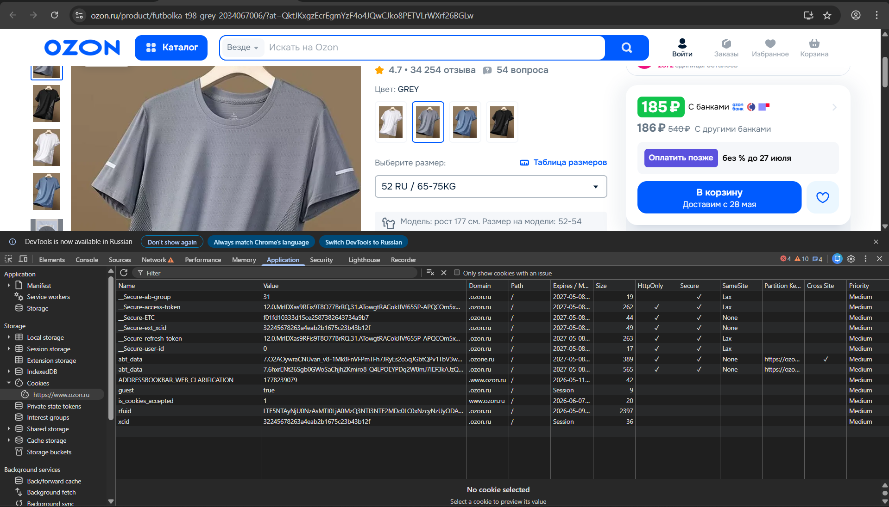

# Задание 5. Исследование Cookies

## Сайт: https://www.ozon.ru

---

## Вопрос 4. Описание 5 выбранных cookies

### Cookie 1 — `_Secure-access-token`
- **Имя:** `_Secure-access-token`
- **Тип:** Постоянный (истекает 2027-05-08)
- **Предполагаемое назначение:** Токен авторизации пользователя (JWT или аналог). Передаётся при каждом запросе к серверу для подтверждения личности пользователя. Содержит зашифрованные данные сессии.

---

### Cookie 2 — `_Secure-refresh-token`
- **Имя:** `_Secure-refresh-token`
- **Тип:** Постоянный (истекает 2027-05-08)
- **Предполагаемое назначение:** Токен для обновления access-token без повторного ввода пароля. Используется, когда срок действия access-token истекает — сервер выдаёт новый токен в обмен на refresh-token.

---

### Cookie 3 — `_Secure-user-id`
- **Имя:** `_Secure-user-id`
- **Тип:** Постоянный (истекает 2027-05-08)
- **Предполагаемое назначение:** Уникальный идентификатор авторизованного пользователя. Используется для связывания запросов с конкретным аккаунтом, персонализации контента, истории заказов.

---

### Cookie 4 — `rfuid`
- **Имя:** `rfuid`
- **Тип:** Постоянный (истекает 2026-05-09)
- **Предполагаемое назначение:** Идентификатор браузера/устройства (browser fingerprint). Используется системой антифрода для распознавания подозрительных действий, а также для аналитики уникальных устройств.

---

### Cookie 5 — `abt_data`
- **Имя:** `abt_data`
- **Тип:** Постоянный (истекает 2027-05-08)
- **Предполагаемое назначение:** Данные для A/B тестирования. Определяет, в какую группу эксперимента попал пользователь (например, новый дизайн кнопки vs. старый). Позволяет показывать одному пользователю одну и ту же версию интерфейса при повторных визитах.

---

## Вопрос 5. Анализ флагов безопасности критичных cookies

Критичными считаются cookies, содержащие токены авторизации и идентификаторы пользователя.

| Cookie | HttpOnly | Secure | SameSite |
|--------|----------|--------|----------|
| `_Secure-access-token` | ✅ | ✅ | Lax |
| `_Secure-refresh-token` | ✅ | ✅ | Lax |
| `_Secure-user-id` | ✅ | ✅ | Lax |
| `xcid` | ❌ | ❌ | — |
| `rfuid` | ❌ | ❌ | — |

### Выводы:

**`_Secure-access-token` и `_Secure-refresh-token`** — настройка **безопасная**:
- **HttpOnly** защищает от кражи токена через XSS-атаку (JavaScript не может прочитать cookie)
- **Secure** гарантирует передачу только по зашифрованному HTTPS-соединению
- **SameSite=Lax** защищает от CSRF-атак при переходах с внешних сайтов
- Префикс `_Secure-` в имени дополнительно обязывает браузер применять Secure-флаг

**`xcid`** — настройка **небезопасная**:
- Отсутствие HttpOnly означает, что значение доступно через `document.cookie` в JavaScript. Если на сайте есть XSS-уязвимость, злоумышленник может похитить этот cookie
- Отсутствие Secure означает возможную передачу по незащищённому HTTP
- Значение совпадает с `_Secure-ext_xcid`, что указывает на связь с идентификацией пользователя — это повышает риск

**`rfuid`** — настройка **приемлемая с оговорками**:
- Не содержит напрямую критичных данных (только fingerprint устройства), поэтому отсутствие флагов менее критично
- Тем не менее доступность через JS позволяет скриптам третьих сторон считывать идентификатор устройства

---

## Вопрос 6. Cookie корзины

 После добавления товара в корзину список cookies не изменился — ни один cookie не был создан или обновлён. Это означает, что Ozon **не хранит состояние корзины на стороне клиента** через cookies. Корзина хранится на сервере и привязана к идентификатору сессии через `xcid` (session cookie). Такой подход является архитектурным решением: сервер ассоциирует содержимое корзины с анонимной сессией, не раскрывая эти данные в браузере. Это считается более безопасной практикой, чем хранение данных корзины непосредственно в cookie.

---

## Вопрос 7. Удаление сессионного cookie

**Выбранный cookie:** `_Secure-access-token`

**Действия:**
1. В DevTools (Application → Cookies → ozon.ru) выбран cookie `_Secure-access-token`
2. Нажата клавиша **Delete** для удаления
3. Страница обновлена (F5)

**Результат:**
После удаления cookie авторизации пользователь был **автоматически разлогинен**. Сайт перестал отображать данные аккаунта: исчезли имя пользователя, история заказов, содержимое корзины. При попытке перейти в личный кабинет произошёл редирект на страницу входа. Это ожидаемое поведение — сервер не смог подтвердить личность пользователя без токена и завершил сессию.

---

## Вопрос 8. Скриншот удаления cookie

*(Приложить скриншот DevTools, на котором видно выделенный cookie `_Secure-access-token` в момент удаления)*